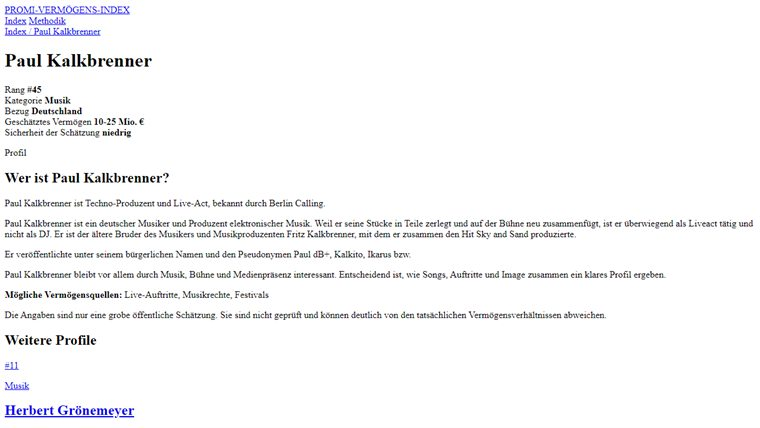

# PROMI-VERMOGENS-INDEX

An editorial-style celebrity wealth archive built with Astro, big typography, and zero interest in looking like a finance dashboard.

Instead of portraits, stock photos, or fake glossy visuals, this project leans on type, spacing, and soft aura gradients. The result is meant to feel more like a digital poster archive than a spreadsheet in disguise.



> Not a finance app. Not a gossip machine. More like a curated index of famous names, public relevance, and rough wealth estimates with a strong visual point of view.

## What's In Here

- a searchable index of 200 German celebrity and public-figure profiles
- category filters and sorting on the main list
- a dedicated detail page for every entry
- related-profile suggestions based on category and rank proximity
- a methodology page that explains what the numbers are and what they are not
- a fully image-free design system built from CSS gradients, grain, and typography

## Why It Feels Different

Most projects in this space drift straight into tabular, cold, overly functional UI. This one deliberately goes the other way.

The site is built like an editorial object:

- huge headlines
- soft lavender backgrounds
- coral glow accents
- clean list rows instead of chunky cards
- no portraits anywhere

It is meant to feel calm, sharp, and a little bit poster-like.

## The Data Bit

The site uses `top200.json` as its source of truth. Routes are generated from the dataset, so the archive is data-driven from the start instead of manually assembled page by page.

Important: the wealth figures are rough public estimates, not verified financial records. They are there for editorial context, not as factual accounting.

## Stack

- Astro
- TypeScript
- plain CSS with custom properties
- JSON data

Nice and lean. No giant UI kit. No image dependency maze. No weird dashboard baggage.

## Run It Locally

```bash
npm install
npm run dev
```

That usually starts the site at `http://127.0.0.1:4321/`.

## Build It

```bash
npm run build
```

The production build lands in `dist/`.

## Deploy Notes

This is a static site, so it is easy to ship on GitHub Pages, Netlify, Vercel, or basically any other static host that behaves itself.

## A Few Honest Notes

- the numbers are estimates
- the ranking is approximate
- categories are simplified on purpose
- country connections are editorial shorthand, not a legal classification

## Ideas For Later

- tighter editorial polish across every biography
- richer filters for country connection and confidence level
- themed collections or spotlight pages
- visual regression snapshots for layout QA

## TL;DR

This is a celebrity wealth archive that tries to feel designed, not dumped. Big type, no portraits, clean structure, and just enough glow to keep it from turning into another boring index.
